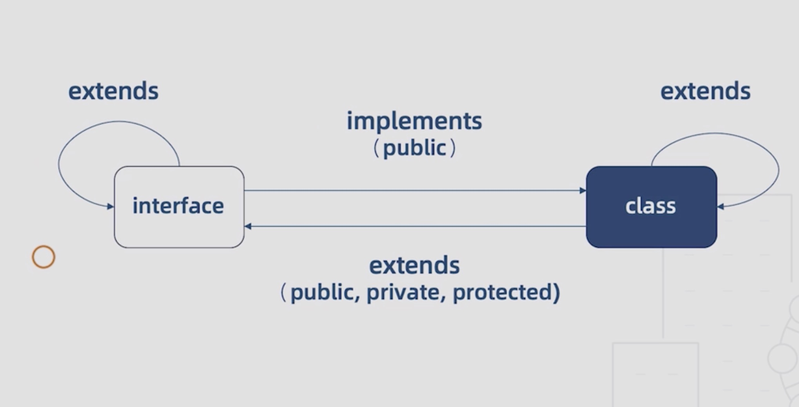
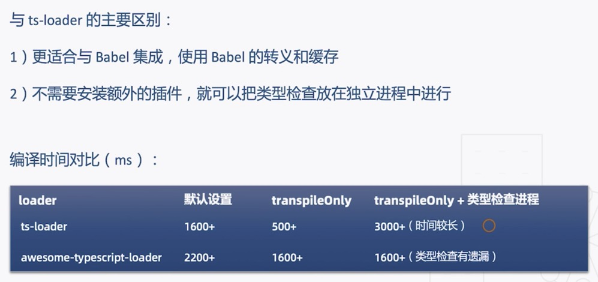
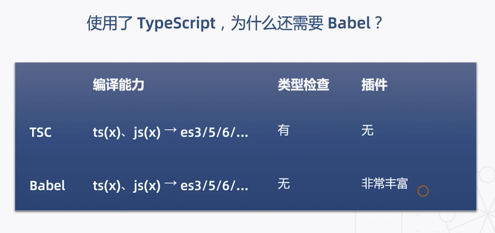
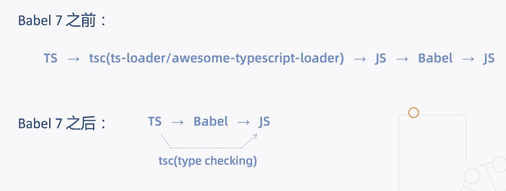
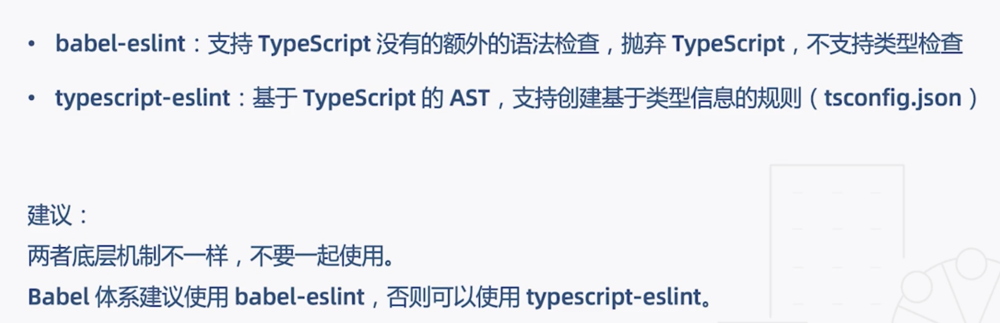
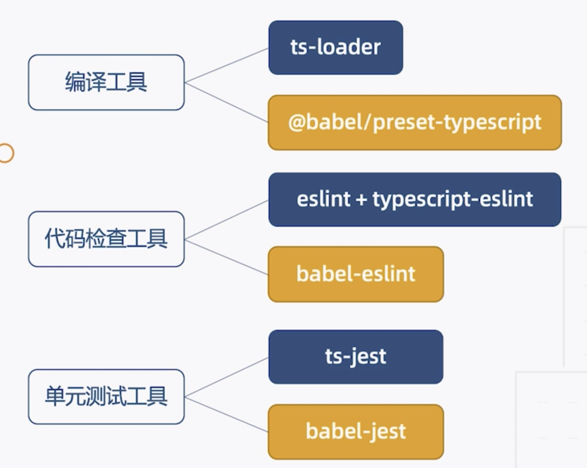

# 开始配置 typescript

1.npm i typescript -g ----全局安装 typescript
2.tsc -h ----查看帮助信息
3.tsc --init ----创建 tsconfig.json

4.建立打包配置

-   webpack.base.config.js 基本配置，公用的
-   webpack.config.js 公用的入口配置
-   webpack.dev.config.js 开发环境
-   webpack.pro.config.js 生产环境

5.更改 package.json

```json
"scripts": {
    "start": "webpack-dev-server --mode=development --config ./build/webpack.config.js",//指定开发环境启动，指定开发配置文件
    "build": "webpack --mode=production --config ./build/webpack.config.js"//指定生产打包，指定生产配置文件
}
```

6.运行

```bash
yarn start or npm run start //开启开发环境启动
yarn build or npm run build //打包
```

# 基础篇

# 基本类型

[datatype](./src/datatype.ts)
[enum](./src/enum.ts)

# 函数类型接口

[interface](./src/interface.ts)

# 对象类型接口

[interface](./src/interface.ts)

# 函数相关知识点梳理

[function](./src/function.ts)

# 类的继承和成员修饰

[class](./src/class.ts)

# 抽象类与多态

[class](./src/class.ts)

# 类与接口的关系

[class-interface](./src/class-interface.ts)



# 泛型函数与泛型接口

[generics](./src/generics.ts)

泛型：不预先确定的数据类型，具体的类型在使用的时候才能确定。

# 泛型类与泛型的约束

[generics](./src/generics.ts)

泛型好处：

-   函数和类可以轻松地支持多种类型，增强程序的扩展性
-   不必写多条函数重载，冗长的联合类型声明，增强代码可读性
-   灵活控制类型之间的约束

# 类型检查机制

## 类型检查机制（1）：类型判断

[advanced](./src/advanced.ts)

## 类型检查机制（2）：类型兼容性

[advanced](./src/advanced.ts)

当一个类型 Y 可以被赋值给另外一个类型 X 时，我们就可以说类型 X 兼容类型 Y

`X 兼容 Y：X（目标类型）=Y（源类型）`

口诀：

`结构之间兼容：成员少的兼容成员多的` <br />

`函数之间兼容：参数多的兼容参数少的`

## 类型检查机制（3）：类型保护

[advanced2](./src/advanced2.ts)

# 高级类型（1）：交差类型和联合类型

[advanced3](./src/advanced3.ts)

# 高级类型（2）：高级索引

[advanced4](./src/advanced4.ts)

# 高级类型（3）：映射类型

[advanced5](./src/advanced5.ts)

# 高级类型（4）：条件类型

[advanced5](./src/advanced5.ts)

# 基础篇总结


# 工程篇

```bash
sudo npm i ts-node -g
```

就可以执行 ts 文件了 `ts-node ./src/project/node/c.node.ts`

单独指定编译`tsc ./src/project/es6/a.ts -m umd tsc ./src/project/es6/a.ts -t es5`

## ES6 与 commonJS 的模块系统

## 使用命名空间

./src/space/a.ts
./src/space/b.ts

tsc ./src/space/b.ts
yarn start 浏览页面

## 理解声明合并

./src/space/merge.ts

## 如何编写声明文件

npm i jquery
npm i @types/jquery -D

在[typescript](https://microsoft.github.io/TypeSearch/)查询，如果没有，就自己写
我们可以通过[definitelytyped](http://definitelytyped.org/guides/contributing.html)看编写声明文件怎么写？

声明文件以 .d.ts 为后缀，例如 ./src/libs/global-lib.d.ts

### 想给库增加自定义的方法

npm i moment

```javascript
import m from "moment";
declare module "moment" {
    export function myFunction(): void;
}
m.myFunction = () => {};

declare global {
    namespace globalLib {
        function doAnything(): void;
    }
}
```

# 配置 tsconfig.json(1):文件选项

tsc 可以编译所有的 ts 文件

```json
//tsconfig.base.json
{
    "files": [
        "src/a.ts"
    ],
    "include": [
        "src"
    ],
    "exclude": [
        "node_modules",
        "src/lib"
    ]
}
//tsconfig.json
{
    "extends": "./tsconfig.base",
    "exclude": [],
    "compileOnSave": true //Atom编译器才有此插件功能
}

```

# 配置 tsconfig.json(2):编译选项

```json

```

# 配置 tsconfig.json(3):工程引用

```javascript
const ForkTsCheckerWebpackPlugin = require("fork-ts-checker-webpack-plugin");
module: {
        rules: [
            {
                test: /\.tsx?$/i,
                use: [
                    {
                        loader: "ts-loader",
                        options: {
                            transpileOnly: true //只做语言转换，不做类型检查,所以还的装一个插件fork-ts-checker-webpack-plugin
                        }
                    }
                ],
                exclude: /node_modules/
            }
        ]
    },
plugins: [
        new HtmlWebpackPlugin({
            template: "./src/tpl/index.html"
        }),
        new ForkTsCheckerWebpackPlugin()
    ]
```

npm i fork-ts-checker-webpack-plugin -D

## awesome-typescript-loader 代替 ts-loader

npm i awesome-typescript-loader -D

```javascript
const { CheckerPlugin } = require("awesome-typescript-loader");//自带检查类型的方法
module: {
        rules: [
            {
                test: /\.tsx?$/i,
                use: [
                    {
                        // loader: "ts-loader",
                        loader: "awesome-typescript-loader",
                        options: {
                            transpileOnly: true//只做语言转换，不做类型检查
                        }
                    }
                ],
                exclude: /node_modules/
            }
        ]
    },
    plugins: [
        new HtmlWebpackPlugin({
            template: "./src/tpl/index.html"
        }),
        new CheckerPlugin()
    ]
```


综合下来建议用 ts-loader

# 编译工具：从 ts-loader 到 Babel

# 使用了 TypeScript，为什么还需要 Babel?



## Babel7 之前：



# 代码检查工具：从 TSLint 到 ESLint



# 使用 Jest 进行单元测试



`npx ts-jest config:init`
